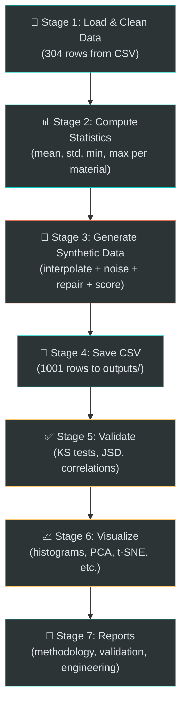
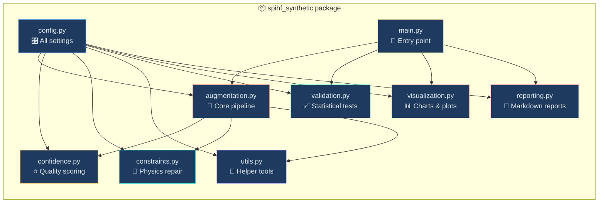

# 🧪 SPIHF Synthetic Data Project — Complete Guide (Explained Simply)

## Table of Contents
1. [What is this project?](#1-what-is-this-project)
2. [The Big Picture (Pipeline Overview)](#2-the-big-picture)
3. [Step-by-Step: How Fake Data is Made](#3-step-by-step-how-fake-data-is-made)
4. [The Modules Explained](#4-the-modules-explained)
5. [How Confidence Scoring Works](#5-how-confidence-scoring-works)
6. [How Validation Works](#6-how-validation-works)
7. [What the Tests Tell Us](#7-what-the-tests-tell-us)
8. [Project File Map](#8-project-file-map)

---

## 1. What is this project?

### The Problem
You have a **small dataset** ([SPIHF_Data.csv](file:///c:/Users/Subhra/Downloads/forming 2/SPIHF_Data.csv)) with only **304 rows** of real experimental data about **Single Point Incremental Hole Flanging (SPIHF)** — a sheet metal forming process.

304 rows is **too few** for training machine learning models or doing deep statistical analysis.

### The Solution
This project creates **1000+ realistic fake (synthetic) data points** that look and behave like the real data, but are mathematically generated. Think of it like this:

> 🍪 **Cookie Analogy**: You have 5 real cookies. You want 100 cookies. So you study the real ones (shape, size, color, taste), then bake new cookies that look and taste similar — but they're not exact copies.

### What the data contains
Each row represents one SPIHF experiment with 20 columns:

| Column | What it means (simple) |
|--------|----------------------|
| Material | What metal sheet was used (e.g., AA7075-O aluminium) |
| Thickness (mm) | How thick the sheet is |
| UTS (MPa) | How strong the metal is before it breaks |
| YS (MPa) | How strong the metal is before it bends permanently |
| HER | Hole Expansion Ratio — how much the hole grew |
| Feed rate (mm/min) | How fast the tool moves |
| Tool speed (rpm) | How fast the tool spins |
| Step depth (mm) | How deep each pass goes |
| ... | And more process/output parameters |

---

## 2. The Big Picture

The entire pipeline runs in **7 stages** when you execute `python -m spihf_synthetic.main`:



---

## 3. Step-by-Step: How Fake Data is Made

This is the **heart** of the project. Let's break down Stage 3 into baby steps.

### Step 3.1 — Group by Material

The 304 real samples belong to ~20 different materials (AA7075-O, DC01, AA6061-T6, etc.). We **never mix materials** — a fake AA7075-O sample is only created from real AA7075-O data.

> 🏫 **School Analogy**: If you have students from Class A and Class B, you don't create a fake Class A student using Class B data. Each class makes its own fake students.

### Step 3.2 — Proportional Allocation

If AA7075-O has 86 out of 304 real samples (28%), it gets ~28% of the 1000 synthetic samples = ~283 fake samples.

```
Material with 86 real rows → gets ~283 synthetic rows
Material with  1 real row  → gets at least 5 synthetic rows (minimum guarantee)
```

### Step 3.3 — SMOTE-Style Interpolation (Making a New Point)

For each fake sample, we:
1. **Pick 2 random real samples** from the same material
2. **Draw a line between them** in feature space
3. **Pick a random point on that line**

The formula is:
```
new_value = α × sample_1  +  (1 - α) × sample_2
```
where `α` is a random number between 0.3 and 0.7 (configured in [config.py](file:///c:/Users/Subhra/Downloads/forming 2/spihf_synthetic/config.py)).

> 🎨 **Color Analogy**: If sample_1 is RED and sample_2 is BLUE, the new point is some shade of PURPLE — it's a blend of both parents. α = 0.5 gives you perfect purple. α = 0.7 gives you more red-ish purple.

```
Real Sample A: [UTS=310, YS=180, Thickness=1.0]
Real Sample B: [UTS=320, YS=190, Thickness=1.2]

α = 0.6 (random)

New Fake:      [UTS = 0.6×310 + 0.4×320 = 314,
                YS  = 0.6×180 + 0.4×190 = 184,
                Thickness = 0.6×1.0 + 0.4×1.2 = 1.08]
```

**Categorical columns** (Material, Precut Shape) are just copied from the first parent — you can't interpolate between "circle" and "square"!

### Step 3.4 — Add Gaussian Noise (Add Randomness)

The interpolated point is too "perfect" — it sits exactly on the line between two real points. So we add tiny random noise:

```
noise = random × (0.5% to 1.5% of the feature's standard deviation)
new_value = interpolated_value + noise
```

> 🎯 **Dart Analogy**: The interpolated point is the bullseye. The noise makes the dart land *near* the bullseye but not exactly on it. The noise is very small — just 0.5-1.5% of how spread out the real data is.

**Special cases**: Lubricant (0 or 1) and Number of stages (1, 2, 3...) get **NO noise** because they must stay as integers.

### Step 3.5 — Repair Physics Violations (Fix Impossible Values)

Noise can create physically impossible values. The [constraints.py](file:///c:/Users/Subhra/Downloads/forming 2/spihf_synthetic/constraints.py) module fixes these:

#### Strength Constraints (Metallurgy Rules)
| Rule | Why | Fix |
|------|-----|-----|
| UTS ≥ YS | Ultimate strength is ALWAYS ≥ yield strength (by definition) | Swap them |
| k ≥ UTS | Hollomon equation: strength coefficient must be ≥ UTS | Set k = UTS × 1.05 |
| 0.01 ≤ n ≤ 1.0 | Strain hardening exponent has physical bounds | Clip to range |

#### Geometry Constraints (Physical Limits)
| Rule | Why | Fix |
|------|-----|-----|
| Thickness ≥ 0.05 mm | Sheet can't be infinitely thin | Clip |
| HER ≥ 1.0 | Hole can only expand, not shrink | Clip |
| Min thickness ≤ Initial thickness | Can't get thicker during forming! | Clip |
| Sine-law check | `t_min ≥ t₀ × sin(angle) × 0.5` — thinning physics | Correct |
| Angle ∈ [1°, 180°] | Physical wall angle limits | Clip |

#### Process Constraints (Machine Limits)
| Rule | Why | Fix |
|------|-----|-----|
| Feed rate ≥ 1.0 mm/min | Machine can't move backwards | Clip |
| Tool speed ≥ 0 rpm | Can't spin negative | Clip |
| Stages ≥ 1 (integer) | Must have at least 1 forming pass | Round + clip |
| Lubricant ∈ {0, 1} | Binary: used or not | Round |

> 🏥 **Hospital Analogy**: The noise is like a doctor prescribing medicine — sometimes the dose goes wrong. The repair step is like a pharmacist double-checking: "Wait, you can't give a negative dose! Let me fix that."

### Step 3.6 — Score Confidence (Rate the Fake Sample)

After repair, each sample gets a **confidence score** from 0 to 1. This answers: *"How believable is this fake sample?"*

(See [Section 5](#5-how-confidence-scoring-works) for the full breakdown.)

### Step 3.7 — Rejection Sampling (Throw Away Bad Ones)

If the confidence score is **below 0.40** (your current threshold), the sample is **thrown away** and a new one is generated.

```
while not enough good samples AND attempts < max_attempts:
    generate new sample
    if confidence < 0.40:
        throw it away ❌
    else:
        keep it ✅
```

The pipeline tries up to **10× the required count** (your current `MAX_ATTEMPTS_MULTIPLIER`).

### Step 3.8 — Remove Near-Duplicates

Even after all this, some samples might be nearly identical. The [utils.py](file:///c:/Users/Subhra/Downloads/forming 2/spihf_synthetic/utils.py) `remove_near_duplicates` function:
1. Normalizes all features to [0, 1]
2. Computes Euclidean distance between every pair
3. If distance < 0.005, removes the duplicate

### Step 3.9 — Gap-Filling

If after rejection sampling and deduplication we still have fewer than 1000 samples, the pipeline:
1. Randomly picks existing good samples
2. Adds very tiny noise (0.5-1.5% — even less than normal)
3. Multiplies their confidence by 0.95 (slight penalty)

---

## 4. The Modules Explained



| Module | File | Role |
|--------|------|------|
| **Config** | [config.py](file:///c:/Users/Subhra/Downloads/forming 2/spihf_synthetic/config.py) | All settings in one place: noise levels, thresholds, column names, physics limits, material aliases |
| **Augmentation** | [augmentation.py](file:///c:/Users/Subhra/Downloads/forming 2/spihf_synthetic/augmentation.py) | The main engine: load → clean → interpolate → noise → repair → score → save |
| **Confidence** | [confidence.py](file:///c:/Users/Subhra/Downloads/forming 2/spihf_synthetic/confidence.py) | Scores each fake sample from 0 to 1 |
| **Constraints** | [constraints.py](file:///c:/Users/Subhra/Downloads/forming 2/spihf_synthetic/constraints.py) | Fixes physically impossible values |
| **Utils** | [utils.py](file:///c:/Users/Subhra/Downloads/forming 2/spihf_synthetic/utils.py) | Helper functions: material mapping, deduplication, formatting |
| **Validation** | [validation.py](file:///c:/Users/Subhra/Downloads/forming 2/spihf_synthetic/validation.py) | Statistical tests comparing fake vs real data |
| **Visualization** | [visualization.py](file:///c:/Users/Subhra/Downloads/forming 2/spihf_synthetic/visualization.py) | Generates comparison plots (histograms, PCA, t-SNE, etc.) |
| **Reporting** | [reporting.py](file:///c:/Users/Subhra/Downloads/forming 2/spihf_synthetic/reporting.py) | Creates publication-quality Markdown reports |
| **Main** | [main.py](file:///c:/Users/Subhra/Downloads/forming 2/spihf_synthetic/main.py) | Orchestrates everything in 7 stages |

---

## 5. How Confidence Scoring Works

The confidence score is a **weighted average of 3 sub-scores**:

```
Total Confidence = 0.40 × Range Score + 0.40 × Distance Score + 0.20 × Correlation Score
```

### Component 1: Range Score (40% weight)

**Question it answers**: *"Are this sample's values within the normal range for its material?"*

**How it works**:
1. For each numeric feature, find the [min, max] from real data of the same material
2. Add a 15% margin on each side (to be lenient)
3. Count what fraction of features fall inside this expanded range

```
Real AA7075-O UTS range: [210, 220]
15% margin = 0.15 × (220 - 210) = 1.5
Accepted range: [208.5, 221.5]

Fake sample UTS = 215 → ✅ In range
Fake sample UTS = 250 → ❌ Out of range
```

> 🏠 **House Analogy**: Real houses on your street cost $200K–$300K. A fake house priced at $250K is believable. A fake house priced at $900K is not.

### Component 2: Distance Score (40% weight)

**Question it answers**: *"How close is this fake sample to the nearest real sample?"*

**How it works**:
1. Normalize all features to [0, 1]
2. Compute Euclidean distance from the fake sample to every real sample
3. Take the minimum distance (nearest neighbor)
4. Convert to score: `score = e^(-distance)`

```
If distance = 0 (identical to real) → score = e^0 = 1.0 (perfect)
If distance = 1 (far away)         → score = e^-1 = 0.37 (low)
If distance = 3 (very far)         → score = e^-3 = 0.05 (terrible)
```

> 📍 **GPS Analogy**: You're trying to place a fake restaurant. If it's right next to real restaurants, it's believable. If it's in the middle of the ocean, nobody will believe it.

### Component 3: Correlation Score (20% weight)

**Question it answers**: *"Does this fake sample preserve the relationships between features?"*

**How it works**:
1. In real data, some features are correlated (e.g., HER ↑ when Flange Height ↑)
2. For each pair with |correlation| > 0.3, check: does the fake sample's deviation from the mean go in the **same direction** as the correlation suggests?
3. Score = fraction of pairs that agree

```
Real data shows: HER and Flange Height are positively correlated (ρ = 0.7)
Real mean: HER = 1.5, Flange Height = 20

Fake sample: HER = 1.8 (above mean ↑), Flange Height = 25 (above mean ↑)
→ Both above mean = same direction = ✅ AGREE

Fake sample: HER = 1.8 (above mean ↑), Flange Height = 15 (below mean ↓)
→ Opposite directions = ❌ DISAGREE (breaks the relationship)
```

> 🎵 **Music Analogy**: In real music, when the bass goes up, the drums usually get louder. If your fake song has bass going up but drums going silent, it sounds wrong — even if each instrument sounds fine individually.

---

## 6. How Validation Works

After generating synthetic data, the pipeline checks: *"How good is the fake data compared to real data?"*

### Test 1: KS Test (Kolmogorov-Smirnov)

**What it checks**: Do the real and fake distributions have the same shape?

For each feature, it answers: "If I shuffled real and fake data together, could you tell which is which just by looking at the distribution?"

- **p-value > 0.05** → ✅ PASS (can't tell the difference — great!)
- **p-value ≤ 0.05** → ❌ FAIL (distributions look different)

Your result: **44.4% pass rate** = about 8 out of 18 features pass

### Test 2: Wasserstein Distance (Earth Mover's Distance)

**What it checks**: How much "work" would it take to transform the fake distribution into the real one?

> 🏗️ **Dirt Analogy**: If the real distribution is a pile of dirt shaped like a hill, and the fake distribution is also a hill — how much dirt do you need to move to make them identical? Less dirt = more similar.

### Test 3: Jensen-Shannon Divergence (JSD)

**What it checks**: How different are the probability distributions?

- **JSD = 0** → Identical distributions
- **JSD = 1** → Completely different distributions
- Your result: **Mean JSD = 0.040** → Very low divergence (good!)

### Test 4: Correlation Matrix Comparison

**What it checks**: Are the relationships between features preserved?

If UTS and YS have correlation 0.85 in real data, do they also have correlation ~0.85 in fake data?

### Test 5: Mahalanobis Distance

**What it checks**: How far is the fake data cloud from the real data cloud, accounting for correlations?

Your result: **321.6** — a high value indicating some multivariate drift.

### Test 6: Feature Importance Similarity

**What it checks**: If you train a Random Forest model on real data, and another on fake data — do they consider the same features important?

### The Overall Grade

All these tests are combined into a composite score:

| Grade | Score | Meaning |
|-------|-------|---------|
| **A** | 90-100% | Excellent — fake data is nearly indistinguishable from real |
| **B** | 75-89% | Good — minor differences |
| **C** | 60-74% | Acceptable — noticeable differences but still useful |
| **D** | 40-59% | Poor — significant gaps |
| **F** | 0-39% | Fail — fake data is not representative |

**Your current grade: C (60.9%)**

---

## 7. What the Tests Tell Us

The project has **4 test files** in the [tests/](file:///c:/Users/Subhra/Downloads/forming 2/tests/) directory. Here's what each one verifies:

### [test_augmentation.py](file:///c:/Users/Subhra/Downloads/forming 2/tests/test_augmentation.py) — "Is the data factory working?"

| Test | What it checks |
|------|----------------|
| `test_interpolated_values_between_parents` | If parent A has UTS=310 and parent B has UTS=320, the child's UTS must be between 310 and 320 |
| `test_categorical_inherited_from_row_i` | Material name comes from parent A (can't interpolate text!) |
| `test_alpha_range_respected` | When α=1.0, the child equals parent A exactly |
| `test_noise_magnitude_small` | Noise changes values by < 50% (very generous upper bound) |
| `test_lubricant_and_stages_untouched` | Lubricant (0/1) and stages (integer) get NO noise |
| `test_generates_requested_count` | Pipeline produces roughly the number you asked for |
| `test_confidence_column_present` | Every synthetic row has a confidence score |
| `test_materials_preserved` | No fake material names appear that aren't in real data |

### [test_constraints.py](file:///c:/Users/Subhra/Downloads/forming 2/tests/test_constraints.py) — "Do the physics guards work?"

| Test | What it checks |
|------|----------------|
| `test_swaps_when_uts_less_than_ys` | If noise makes UTS < YS, they get swapped |
| `test_hollomon_k_corrected` | Strength coefficient k ≥ UTS (Hollomon equation) |
| `test_hardening_exponent_clipped` | n stays in [0.01, 1.0] |
| `test_thickness_minimum` | Thickness ≥ 0.05 mm |
| `test_her_minimum` | HER ≥ 1.0 (hole can only expand) |
| `test_min_thickness_leq_initial` | After forming, metal can't be THICKER than before |
| `test_feed_rate_minimum` | Feed rate ≥ 1.0 mm/min |
| `test_stages_integer_and_positive` | 2.7 stages → rounded to 3 |
| `test_lubricant_binary` | 0.7 → rounded to 1 |
| `test_multiple_violations_all_fixed` | If 4 things are wrong, ALL 4 get fixed |
| `test_repair_returns_copy` | Fixing one sample doesn't accidentally modify another |

### [test_confidence.py](file:///c:/Users/Subhra/Downloads/forming 2/tests/test_confidence.py) — "Is the quality scoring reliable?"

| Test | What it checks |
|------|----------------|
| `test_real_sample_scores_high` | A REAL sample should score ≥ 0.8 (it IS real, after all!) |
| `test_extreme_sample_scores_low` | A sample with 100× multiplied values should score < 0.5 |
| `test_identical_sample_scores_one` | A copy of a real sample → distance score ≈ 1.0 |
| `test_far_sample_scores_lower` | Further from real data → lower distance score |
| `test_insufficient_data_returns_half` | With < 3 rows, correlation score defaults to 0.5 (neutral) |
| `test_score_bounded` | Total confidence is always in [0, 1] |
| `test_weights_sum_to_one` | 0.40 + 0.40 + 0.20 = 1.0 ✓ |

### [test_utils.py](file:///c:/Users/Subhra/Downloads/forming 2/tests/test_utils.py) — "Do the helper tools work?"

| Test | What it checks |
|------|----------------|
| `test_known_aliases_resolve` | "Al 1050" maps to "AA1050" |
| `test_canonical_maps_to_self` | "AA7075-O" maps to "AA7075-O" |
| `test_removes_identical_duplicates` | 5 identical samples → 1 |
| `test_preserves_distinct_samples` | 3 different samples → 3 (no false removal) |
| `test_fmt_float_nan` | NaN → "N/A" (no crashes) |
| `test_detects_extreme_outlier` | Value of 10,000 among 0-99 → flagged |
| `test_nan_to_none` | NaN → None for JSON (JSON can't handle NaN) |

### Running the Tests

```bash
pytest tests/ -v
```

---

## 8. Project File Map

```
forming 2/
├── 📄 SPIHF_Data.csv                 ← THE ORIGINAL: 304 real experiments
├── 📄 synthetic_SPIHF.csv            ← OLD synthetic file (July 3, outdated)
│
├── 📦 spihf_synthetic/               ← THE MAIN PACKAGE
│   ├── __init__.py                   ← Package marker
│   ├── config.py                     ← 🎛️ All settings & constants
│   ├── main.py                       ← 🚀 Entry point (7-stage pipeline)
│   ├── augmentation.py               ← 🧬 Core: interpolate + noise
│   ├── confidence.py                 ← ⭐ Quality scoring (3 components)
│   ├── constraints.py                ← 🔧 Physics repair (4 checks)
│   ├── utils.py                      ← 🔨 Helpers (aliases, dedup, format)
│   ├── validation.py                 ← ✅ Statistical tests (KS, JSD, etc.)
│   ├── visualization.py              ← 📊 6 types of comparison plots
│   └── reporting.py                  ← 📝 3 Markdown reports
│
├── 🧪 tests/                         ← UNIT TESTS
│   ├── conftest.py                   ← Shared test data fixtures
│   ├── test_augmentation.py          ← Tests for data generation
│   ├── test_confidence.py            ← Tests for quality scoring
│   ├── test_constraints.py           ← Tests for physics repair
│   └── test_utils.py                 ← Tests for helper functions
│
├── 📂 outputs/                        ← ALL NEW OUTPUTS GO HERE
│   ├── synthetic_SPIHF.csv           ← ✨ THE NEW synthetic CSV (1001 rows)
│   ├── figures/
│   │   ├── distribution_comparison.png
│   │   ├── boxviolin_comparison.png
│   │   ├── correlation_heatmap.png
│   │   ├── pca_comparison.png
│   │   ├── tsne_comparison.png
│   │   ├── umap_comparison.png
│   │   └── engineering_relationships.png
│   └── reports/
│       ├── validation_report.md
│       ├── validation_report.txt
│       ├── validation_metrics.json
│       ├── engineering_report.md
│       └── methodology_report.md
│
├── 📄 augmentation_pipeline.py       ← OLD monolithic script (July 3)
├── 📄 validation_module.py           ← OLD validation (July 3)
├── 📄 visualization_module.py        ← OLD visualization (July 11)
├── 📄 report_generator.py            ← OLD reporting (July 11)
└── 📄 benchmark_model.py             ← ML benchmark comparing real vs synthetic
```

---

## Quick Summary: The Entire Flow in One Sentence

> Take 304 real metal-forming experiments → group by material → blend pairs of real samples (SMOTE interpolation) → add tiny random noise → fix any physics violations → score quality → keep only good ones → save 1001 synthetic samples → statistically verify they match the real data → generate comparison plots and reports.

That's it! 🎉
